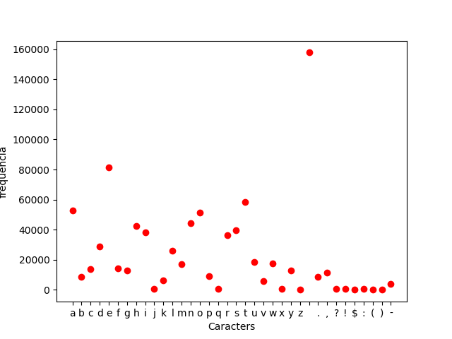
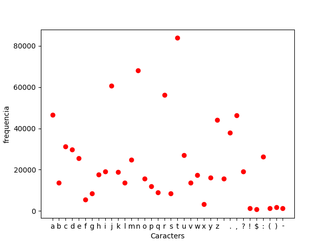

# SPD - Exercici 3: Xifrat i índex de coincidència

**Autor:** Francesc Xavier Bullich Parra

## Métode de xifratge

[Veure fitxer funcions](https://github.com/fxbp/spd-ex3/blob/master/funcions.py)

[Veure fitxer xifrat](https://github.com/fxbp/spd-ex3/blob/master/xifrat.py)

[Veure fitxer desxifrat](https://github.com/fxbp/spd-ex3/blob/master/desxifrat.py)

[Veure fitxer indexC](https://github.com/fxbp/spd-ex3/blob/master/indexC.py)


He escollit la següent combinació de métodes de xifratge per realitzar l'exercici:

- Xifrat PlayFair com a xifrat per substitució
- Xifrat RailFence com a xifrat per transposició


Per xifrar els missatges primer aplico el xifrat playFair i un cop xifrat aplico la transposició amb RailFence. Obviament per desxifrar s'haurà d'aplicar el procès invers.

### Xifrat PlayFair

El xifrat PlayFair es un xifrat de substitució poligràfic per parelles de caràcters. Per tant cada cop que es fa una substitucio és fa per a 2 caràcters alhora. Donat que és poligràfic, el xifrat d'un càracter concret pot resultar en varis caracters diferents, segons la parella que l'acompanya.

El métode es el mateix que hi ha als apunts per el tema 3 però he modificat la mida de la taula a 6 x 6 per poder tenir en compte més simbols com l'espai el punt o la coma.

He tingut en compte les següents consideracions alhora d'aplicar el métode:

- L'alfabet, tant d'entrada com de sortida, son les lletres minúscules [a-z] més els simbols ' ', '.', ',', '?','!','$',':','(',')' i '-'
- La taula resultant es de 6 x 6
- Els primers caràcters de la taula son els de la clau sense repeticions, es completa la taula amb els caràcters vàlids restants.
- Per poder xifrar correctament s'ha de preprocessar el text. S'ha d'afegir un caràcter no important entre els parells de caràcters iguals. En el meu cas el caràcter es '$' que no forma part de l'alfabet
- Els caràcters que no formen part de l'alfabet es posen tal com venen.
- Si s'ha de fer una parella amb un caràcter de l'alfabet i un que no es a l'alfabet, cap dels dos serà encriptat.

Com s'ha vist a classe aquest xifrat intenta trencar el criptoanàlisi per taules de frequencia. Un fet important es que la taula de xifratge varia en funció de la clau. Per tant la clau juga un paper molt important alhora de mantenir la seguretat del xifratge.

Aquest fet és important, ja que si es dona per suposat que l'algoritme de xifrat pot ser conegut per els altres, la clau és l'unic impediment gran alhora de trencar el xifratge.

### Xifrat RailFence

Utilitzo el mateix xifrat de Railfence vist en l'exercici 1.

- L'alfabet, tant d'entrada com de sortida, son les lletres minúscules [a-z] més els simbols ' ', '.', ',', '?','!','$',':','(',')' i '-'
- El nombre de rails utilitzat és la mida de la clau proporcionada per el PlayFair.

Un cop més es veu la importancia de mantenir en secret la clau per desxifrar el missatge. Com ja s'ha comentat els algorimtes poden ser publics per tant les claus de xifrat jugen un paper molt important.

En els dos mètodes s'utilitza un sistema de clau simetrica.


## Exemples de xifratge

### Exemple de xifratge:

- clau: 'esunaprova'
- text: This is a little test. All text is in the same line. Testing, tested and test.
- fitxers:
  - Entrada: test1.txt
  - SortidaEncritptat: outTest1.txt
  - EntradaEncriptat: outTest1.txt
  - SortidaDesencriptat: dex1.txt

Taula 6x6 amb clau prova:
 ```
 'e', 's', 'u', 'n', 'a', 'p',
 'r', 'o', 'v', 'b', 'c', 'd',
 'f', 'g', 'h', 'i', 'j', 'k',
 'l', 'm', 'q', 't', 'w', 'x',
 'y', 'z', ' ', '.', ',', '?',
 '!', '$', ':', '(', ')', '-'
 ```

Proces xifrat-desxifrat:

```
python xifrat.py
Entra el nom del fitxer on hi ha el text clar: textos/test1.txt
Entra el nom de fitxer on es guardarà el text xifrat: textos/outTest1.txt
Entra la clau amb la que vols xifrar: esunaprova
ql..piynnhyqubgunguns,.nmm..burq.w,qqt.psh(.liqtmuumepuysn.zfwqysin(ut!.ul?l,mp.
Encryption finalized. Result in outTest1.txt

python desxifrat.py
Entra el nom del fitxer on hi ha el text xifrat: textos/outTest1.txt
Entra el nom de fitxer on es guardarà el resultat de desxifrat: textos/dex1.txt
Entra la clau amb la que vols desxifrar: esunaprova
this is a little test. all text is in the same line. testing, tested and test.
Decrytion finalized. Result in dex1.txt
```

Com és pot observar l'única diferència entre el xifrat i el desxifrat és que no conserva les majúscules.
Tampoc funcionaria si hi hagessin números.


### Exemple 2: text amb més d'una linia:

- clau: 'tincclaus'
- text: hola


aqui hi ha espais

no se com surtira?

- fitxers:
  - Entrada: testC.txt
  - SortidaEncritptat: outTest.txt
  - EntradaEncriptat: outTest.txt
  - SortidaDesencriptat: desTest.txt

Taula 6x6 amb clau tincclaus:
```

't', 'i', 'n', 'c', 'l', 'a',
'u', 's', 'b', 'd', 'e', 'f',
'g', 'h', 'j', 'k', 'm', 'o',
'p', 'q', 'r', 'v', 'w', 'x',
'y', 'z', ' ', '.', ',', '?',
'!', '$', ':', '(', ')', '-'
```

Proces xifrat-desxifrat:

```
python xifrat.py
Entra el nom del fitxer on hi ha el text clar: textos/testC.txt
Entra el nom de fitxer on es guardarà el text xifrat: textos/outTest.txt
Entra la clau amb la que vols xifrar: tincclaus
jokgibbaan,,,tzqzj
zubb
jtas-
snjnfxts
pni
q
Encryption finalized. Result in textos/outTest.txt

python desxifrat.py
Entra el nom del fitxer on hi ha el text xifrat: textos/outTest.txt
Entra el nom de fitxer on es guardarà el resultat de desxifrat: textos/desTest.txt
Entra la clau amb la que vols desxifrar: tincclaus
hola


aqui hi ha espais

no se com surtira?
Decrytion finalized. Result in textos/desTest.txt
```

### Exemple 3: exemple amb un llibre

En aquest cas provare amb el llibre Dracula de Bram Stoker. No posaré el contingut del text ja que és mol llarg. Hi ha els fitxes adjuns, tant original com encriptat i desencriptat.

- clau: 'intentambllibre'
- text: <veure fitxer Dracula.txt>

- fitxers:
  - Entrada: DRACULA.txt
  - SortidaEncritptat: DraculaEnc.txt
  - EntradaEncriptat: DraculaEnc.txt
  - SortidaDesencriptat: DraculaDes.txt

Taula 6x6 amb clau tincclaus:
```
'i', 'n', 't', 'e', 'a', 'm',
'b', 'l', 'r', 'c', 'd', 'f',
'g', 'h', 'j', 'k', 'o', 'p',
'q', 's', 'u', 'v', 'w', 'x',
'y', 'z', ' ', '.', ',', '?',
'!', '$', ':', '(', ')', '-'
```

```
python xifrat.py
Entra el nom del fitxer on hi ha el text clar: textos/Dracula.txt
Entra el nom de fitxer on es guardarà el text xifrat: textos/DraculaEnc.txt
Entra la clau amb la que vols xifrar: intentambllibre

Encryption finalized. Result in textos/DraculaEnc.txt

python desxifrat.py
Entra el nom del fitxer on hi ha el text xifrat: textos/DraculaEnc.txt
Entra el nom de fitxer on es guardarà el resultat de desxifrat: textos/DraculaDes.txt
Entra la clau amb la que vols desxifrar: intentambllibre

Decrytion finalized. Result in textos/DraculaDes.txt
```

## Càlcul de l'índex de coincidència

Utilitzarè el llibre de Dracula per caluclar l'index de coincidencia.

Calculo en primer lloc el text en pla:

```
python indexC.py
Entra el fitxer al que vols calcular l'index de coincidencia: textos/Dracula.txt
L'index de coincidencia del text xifrat és: 2.7753480946054805
```



Si s'obserba el text en pla es pot veure que hi ha caràcters que tenen una representació mol superior als altres. Aixó es normal en un text clar en un idioma qualsevol, sempre hi ha lletres que apareixen més que les altres.

Es mostra ara el ic del text xifrat:

```
python indexC.py
Entra el fitxer al que vols calcular l'index de coincidencia: textos/DraculaEnc.txt
L'index de coincidencia del text xifrat és:  1.7325251425952384
```




Observant el gràfic podem veure que encara hi ha caràcters que predominen sobre els altres pero ara s'ha reduit bastant la diferencia entre ells i comença a homogeneitzar-se el nombre d'aparicions.
En un von sistema d'encriptament el que busquem es que tots els caràcters tinguin mes o menys la mateixa frequencia.

En el cas del PlayFair depen molt de la clau assignada, ja que canvia la taula de xifratge. també depen molt de com vinguin els caràcters, ja que s'agafen de dos en dos, algunes de les condicions son que es codifica el caràcter amb el de sota o el de la dreta, per tant el primer caràcter es converteix en el segon. Això implica que traslladem algunes de les aparicions del caracter 1 al caracter 2. Una mica com passa amb el xifratge cesar.

Per tant tot i que s'ha reduit bastant l'index de coincidencia, encara podriem millorar-lo buscant un algoritme que homogeneitzes les freqcuencies entre caracters.
